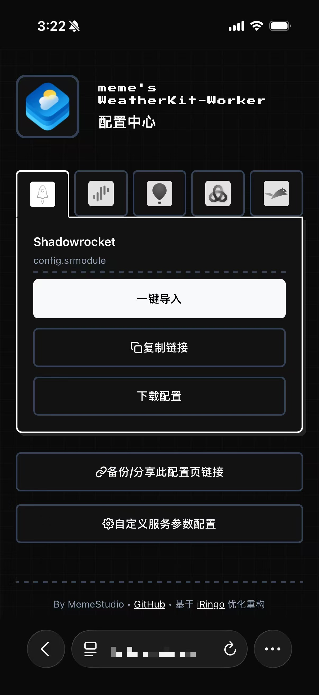
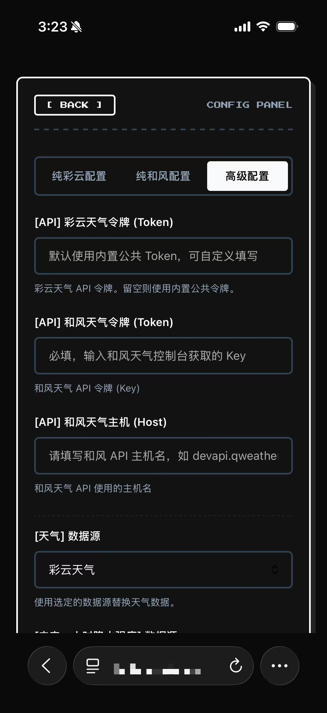

#  WeatherKit-Proxy

这是一个对 [NSRingo/WeatherKit](https://github.com/NSRingo/WeatherKit) 进行重构与改造的项目，使其支持自主独立部署在 **Cloudflare Workers** 与 **Vercel**。移除了所有本地繁琐的脚本代理依赖，提供一键独立部署与代理配置的动态下载。


---

## 🚀 部署指南

### 部署到 Cloudflare Workers

#### 方式 1：通过 Cloudflare 网页后台部署
1. 登录您的 [Cloudflare 仪表板](https://dash.cloudflare.com/)。
2. 依次进入 **Workers 和 Pages** -> **创建** -> **克隆 Git 存储库**。
3. 在 **Git 存储库 URL** 输入框中，直接填入本项目的 Git 地址：
   `https://github.com/meme-lau/weatherkit-proxy.git`
4. 点击 **下一步**，Cloudflare 将在云端自动完成打包构建并为您分配部署的 Workers 域名。

#### 方式 2：通过本地命令行部署（适合开发者）
##### 1. 准备工作
- 确保您本地已安装 [Node.js](https://nodejs.org/) 环境。
- 准备一个 Cloudflare 账号。

##### 2. 克隆项目与安装依赖
```bash
git clone https://github.com/meme-lau/weatherkit-proxy.git
cd weatherkit-proxy
npm install
```

##### 3. 登录并一键部署
```bash
# 登录您的 Cloudflare 账号
npx wrangler login

# 部署服务
npm run deploy:wrangler
```

---

### 部署到 Vercel

#### 方式 1：通过 Vercel 网页后台部署

1. 登录您的 [Vercel 控制台](https://vercel.com/)。
2. 依次点击 **Add New** -> **Project**。
3. 导入您 Fork 或克隆的 GitHub 仓库。
4. Vercel 将会自动识别根目录下的 `vercel.json` 并应用配置（无需修改构建配置，框架默认选择 `Other` 即可）。
5. 点击 **Deploy** 进行部署，Vercel 将在云端自动完成打包构建并为您分配部署的 Vercel 域名。

#### 方式 2：通过本地命令行部署（适合开发者）

##### 1. 准备工作

- 确保您本地已安装 [Node.js](https://nodejs.org/) 环境。
- 准备一个 Vercel 账号。

##### 2. 克隆项目与安装依赖

```bash
git clone https://github.com/meme-lau/weatherkit-proxy.git
cd weatherkit-proxy
npm install
```

##### 3. 登录并一键部署

```bash
# 登录您的 Vercel 账号
npx vercel login

# 部署服务
npm run deploy:vercel
```

---

## ⚙️ 可视化配置中心与一键导入

部署成功后，**直接在浏览器中访问您部署的服务根路径地址**即可打开专有的**无状态配置中心**：
`https://<your-deployed-host>/`

| 配置中心主页 | 自定义参数配置面板 |
| :---: | :---: |
|  |  |

### 🎨 核心功能特点

- ⚡ **极简客户端导入**：界面预整合了主流代理客户端卡片（**Shadowrocket、Surge、Loon、Stash、Egern**）。选中对应客户端，即可直接进行**一键拉起导入**、**一键复制订阅链接**或**直接下载配置文件**。
- ⚙️ **多预设参数配置 (Preset Panels)**：
  - **快速预设选项卡**：支持在 **“纯彩云配置”**、**“纯和风配置”** 与 **“高级配置”** 间无缝切换，快速设置彩云 Token 或和风 Token & Host。
  - **数据源深度定制**：在高级配置中，可独立选择并混合搭配天气、降水、空气指数、污染物等不同提供商。
  - **内置算法与多国标准适配**：内置空气质量换算公式，支持中国国标 (HJ 633-2012 / 2025年草案)、美国 NowCast、欧盟 EAQI、德国 LQI 等；支持多达 18 种空气替换目标标准。
  - **性能与额外开关**：提供**边缘节点缓存 (EdgeCache)** 开关提升二次请求响应速度，并可自由开启逐日/逐小时预报数据源替换。
- 💾 **一键分享与备份**：提供“备份/分享此配置页链接”按钮，点击后将当前全部配置状态编码打包进 URL 链接中。您可以通过该链接在其他设备上直接还原并同步您的所有设置。

